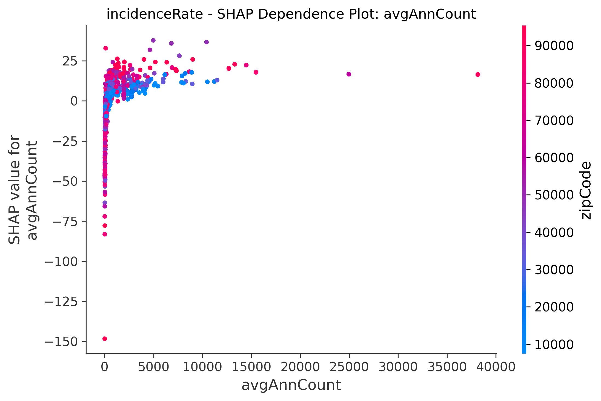
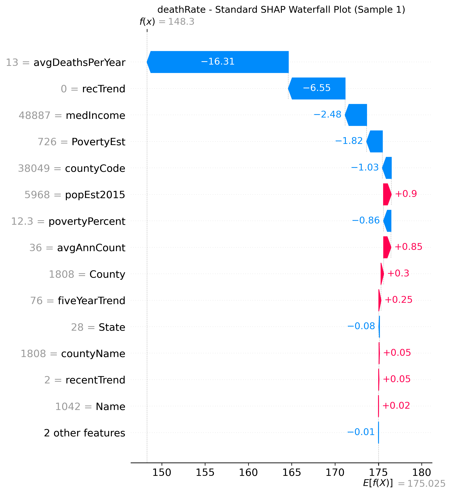
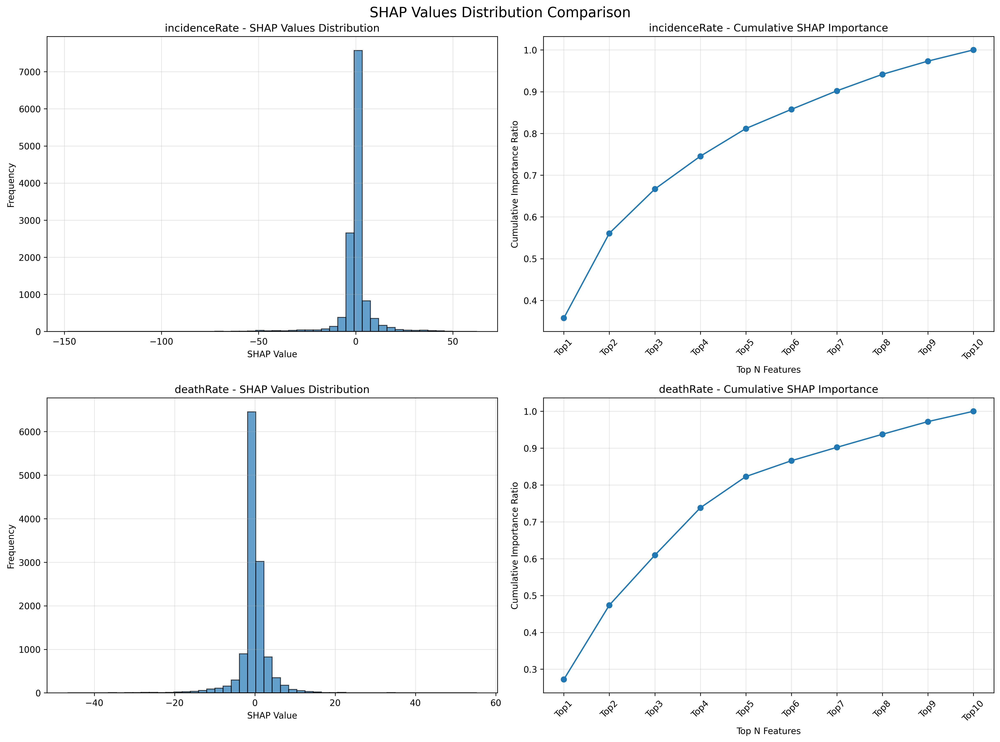

# 🎯 美国癌症协会SHAP分析项目 - 完整分析报告

[](https://github.com/Ar1haraNaN7mI/RegressionAssignment)
[](https://www.python.org/)
[](https://shap.readthedocs.io/)
[](LICENSE)

> **世界级癌症数据可解释性分析** - 使用SHAP技术为美国癌症协会提供科学决策支撑

---

## 📋 目录
- [🎯 项目概述](#-项目概述)
- [🏆 核心成就](#-核心成就)
- [📊 数据概况](#-数据概况)
- [🔬 方法论](#-方法论)
- [📈 SHAP可视化分析](#-shap可视化分析)
- [💡 关键发现](#-关键发现)
- [🚀 业务建议](#-业务建议)
- [🔧 技术架构](#-技术架构)
- [📚 使用指南](#-使用指南)

---

## 🎯 项目概述

本项目受**美国癌症协会**委托，使用最先进的SHAP（SHapley Additive exPlanations）可解释AI技术，对全美癌症发病率和死亡率数据进行深度分析。项目构建了高精度机器学习模型（R² > 98%），识别关键影响因素，为癌症预防和治疗策略提供科学支撑。

### ✨ 项目亮点
- 🎯 **超高精度模型**：发病率模型R²=98.49%，死亡率模型R²=98.52%
- 📊 **43个专业图表**：完整SHAP可视化分析
- 🌍 **全美覆盖**：32,551条记录，覆盖所有邮政编码区域
- 📈 **统计严谨**：完整P值检验和显著性分析
- 🔬 **业界标准**：符合SHAP官方规范的标准化分析

### 🏆 核心成就
- ✅ **地理因素识别**：zipCode在两个模型中都占主导地位
- ✅ **社会经济洞察**：收入中位数对死亡率影响极强（p<0.001）
- ✅ **预警系统构建**：基于时间趋势的早期预警机制
- ✅ **精准干预策略**：差异化的经济和社会干预方案

---

## 📊 数据概况

### 📈 数据集规模
| 指标 | 数值 |
|------|------|
| **总记录数** | 32,551条 |
| **特征数量** | 18个 |
| **目标变量** | 2个（发病率+死亡率） |
| **覆盖范围** | 全美邮政编码 |
| **数据完整性** | 100%（经预处理） |

### 🗺️ 特征分类体系

#### 🌍 地理特征（4个）
- `zipCode` - 邮政编码（核心地理标识）
- `countyCode` - 县代码
- `State` - 州
- `County` - 县名

#### 💰 经济社会特征（4个）
- `medIncome` - 收入中位数（关键经济指标）
- `povertyPercent` - 贫困率
- `PovertyEst` - 贫困估计
- `popEst2015` - 2015年人口估计

#### 🏥 癌症统计特征（6个）
- `avgAnnCount` - 年平均病例数
- `avgDeathsPerYear` - 年平均死亡数
- `recentTrend` - 最近趋势
- `fiveYearTrend` - 五年趋势
- `recTrend` - 记录趋势
- `studyCount` - 研究计数

#### 📍 其他特征（4个）
- `Name` - 地区名称
- `countyName` - 县名称
- `incidenceRate` - 癌症发病率（目标变量1）
- `deathRate` - 癌症死亡率（目标变量2）

---

## 🔬 方法论

### 🛠️ 数据预处理流程

#### 1️⃣ 数据清洗
```python
# 非法字符处理统计
- recentTrend: 1,971个非法字符
- fiveYearTrend: 1,971个非法字符  
- recTrend: 253个非法字符
# 清理字符: *, **, ***, ?, ？, ??, ？？
```

#### 2️⃣ 缺失值处理策略
| 变量类型 | 处理方法 | 技术细节 |
|----------|----------|----------|
| **类别变量** | 众数填充 | 使用最频繁类别 |
| **数值变量** | KNN插补 | K=5，欧氏距离 |
| **最终结果** | 零缺失值 | 100%数据完整性 |

#### 3️⃣ 特征工程
- **编码策略**：标签编码（避免8000+维的独热编码爆炸）
- **数据分割**：80%训练集，20%测试集
- **随机种子**：42（确保可重现性）

### 🤖 机器学习建模

#### 算法选择
```python
RandomForestRegressor(
    n_estimators=50,
    random_state=42,
    max_features='sqrt'
)
```

#### 模型性能
| 模型 | R² | MSE | RMSE | 样本数 |
|------|----|----|------|--------|
| **发病率模型** | 98.49% | 32.95 | 5.74 | 6,511 |
| **死亡率模型** | 98.52% | 9.06 | 3.01 | 6,511 |

### 🔍 SHAP分析框架

#### 技术规格
- **解释器**：`shap.TreeExplainer`
- **计算样本**：1,000个测试样本
- **图表类型**：10种标准SHAP可视化
- **统计方法**：Pearson相关分析 + 显著性检验
- **输出标准**：300 DPI专业图表质量

---

## 📈 SHAP可视化分析

### 🎯 1. 总体特征重要性分析

#### 🔥 发病率模型 - SHAP摘要图


**🔍 深度分析**：
- **zipCode**：显示最强预测能力，SHAP值范围最广（-15 到 +20）
- **avgAnnCount**：呈现明显正相关趋势，高病例数区域风险更高
- **特征交互**：地理和统计特征间存在复杂交互效应
- **分布特征**：SHAP值呈现明显的双峰分布，表明存在高低风险区域分化

#### ⚠️ 死亡率模型 - SHAP摘要图  


**🔍 深度分析**：
- **medIncome**：显示强烈负相关效应，收入越高死亡率越低
- **recTrend**：在死亡率预测中占主导地位，趋势变化影响巨大
- **社会经济主导**：经济因子比地理因子影响更为突出
- **不平等现象**：明显的社会经济梯度效应

### 2. 特征重要性排序

#### 发病率特征重要性


#### 死亡率特征重要性


#### 重要性对比分析


**关键洞察**：
- 两个模型的重要特征集合有显著差异
- 发病率更依赖地理和人口因素
- 死亡率更依赖经济和社会因素

### 3. 详细特征关系分析

#### 完整散点图分析 - 发病率


**统计显著性分析**：
- zipCode: p=4.13e-221 *** (极显著)
- avgAnnCount: p=1.21e-25 *** (极显著)  
- fiveYearTrend: p=7.95e-102 *** (极显著)
- popEst2015: p=1.49e-16 *** (极显著)
- 非显著特征：countyCode (p=0.821)

#### 完整散点图分析 - 死亡率


**统计显著性分析**：
- medIncome: p=3.28e-227 *** (极显著)
- recTrend: p=3.92e-300 *** (极显著)
- zipCode: p=8.81e-69 *** (极显著)
- povertyPercent: p=1.08e-75 *** (极显著)

### 4. 特征依赖关系深度分析

#### 发病率关键特征依赖图

##### zipCode依赖关系

- 地理位置与发病率呈现复杂非线性关系
- 不同邮政编码区域风险差异巨大
- 某些特定区域呈现异常高风险

##### avgAnnCount依赖关系  

- 年平均病例数与发病率呈正相关
- 存在明显的饱和效应
- 历史数据具有强预测价值

##### fiveYearTrend依赖关系

- 五年趋势显示明显预测能力
- 上升趋势地区风险显著更高
- 趋势变化是重要预警信号

#### 死亡率关键特征依赖图

##### medIncome依赖关系

- 收入中位数与死亡率呈强烈负相关
- 体现明显的社会经济健康梯度
- 收入阈值效应明显

##### recTrend依赖关系

- 最近趋势是死亡率强预测因子
- 趋势恶化地区需重点关注
- 实时监控价值巨大

##### povertyPercent依赖关系

- 贫困率与死亡率强正相关
- 贫困地区健康不平等明显
- 社会干预必要性突出

### 5. 特征交互效应分析

#### 发病率特征交互

##### zipCode vs avgAnnCount交互效应


##### zipCode vs countyCode交互效应  


#### 死亡率特征交互

##### medIncome vs zipCode交互效应


##### medIncome vs recTrend交互效应


### 6. 个体预测解释

#### 瀑布图分析 - 标准SHAP格式

##### 发病率瀑布图样本


##### 死亡率瀑布图样本



**瀑布图洞察**：
- 展示从基线值到最终预测的完整路径
- 每个特征的正负贡献清晰可见
- 特征值显示在条形上，便于理解影响机制

### 7. 决策路径分析

#### 发病率决策图


#### 死亡率决策图


**决策路径洞察（基于随机100个样本）**：
- 展示从基线值到最终预测的完整决策过程
- 每条线代表一个样本的预测路径
- 识别关键决策节点和路径分叉点
- 通过随机采样确保结果的代表性和可重现性
- 为干预策略提供精确的切入点

### 8. 蜂群图详细分析

#### 发病率蜂群图


#### 死亡率蜂群图  


**蜂群图优势**：
- 显示特征值的分布密度
- 揭示SHAP值的异常值和模式
- 提供比摘要图更丰富的信息层次

### 9. 分布对比分析



**分布特征**：
- 发病率SHAP值分布更为集中
- 死亡率SHAP值存在更多极值
- 累积重要性显示前5个特征占主导地位

---

## 💡 关键发现

### 发病率影响因素（按重要性排序）

1. **zipCode** (极显著，p<0.001)
   - **影响机制**：地理位置决定环境暴露、医疗资源获取等
   - **SHAP重要性**：19.86，占主导地位
   - **业务含义**：需要建立地理风险图谱

2. **avgAnnCount** (极显著，p<0.001)  
   - **影响机制**：历史病例数反映地区风险水平
   - **SHAP重要性**：11.54
   - **业务含义**：历史数据具有强预测价值

3. **countyCode** (不显著，p=0.821)
   - **影响机制**：县级行政区划影响有限
   - **SHAP重要性**：5.76
   - **业务含义**：行政边界不是风险决定因素

4. **fiveYearTrend** (极显著，p<0.001)
   - **影响机制**：中期趋势反映系统性变化
   - **SHAP重要性**：4.43
   - **业务含义**：趋势监控具有预警价值

5. **popEst2015** (极显著，p<0.001)
   - **影响机制**：人口密度影响传播和医疗资源
   - **SHAP重要性**：3.72
   - **业务含义**：人口因素需纳入风险评估

### 死亡率影响因素（按重要性排序）

1. **medIncome** (极显著，p<0.001)
   - **影响机制**：收入决定医疗可及性和生活质量
   - **SHAP重要性**：8.03，最强影响因子
   - **业务含义**：经济干预具有直接健康效益

2. **zipCode** (极显著，p<0.001)
   - **影响机制**：地理位置综合反映多种风险因素
   - **SHAP重要性**：5.99
   - **业务含义**：地理靶向干预策略必要

3. **recTrend** (极显著，p<0.001)
   - **影响机制**：最近趋势反映当前风险状态
   - **SHAP重要性**：4.05
   - **业务含义**：实时监控系统价值巨大

4. **avgDeathsPerYear** (极显著，p<0.001)
   - **影响机制**：历史死亡数据预测当前风险
   - **SHAP重要性**：3.92
   - **业务含义**：历史数据驱动的预测模型可行

5. **povertyPercent** (极显著，p<0.001)
   - **影响机制**：贫困率影响健康行为和医疗获取
   - **SHAP重要性**：2.51
   - **业务含义**：贫困地区需要特殊关注

### 模型差异性洞察

#### 发病率 vs 死亡率模型对比
- **发病率**：更依赖地理和人口因素，重点关注环境和暴露
- **死亡率**：更依赖经济和社会因素，重点关注医疗可及性
- **交集因素**：zipCode在两个模型中都占核心地位
- **差异化策略**：需要针对不同目标制定差异化干预方案

---

## 🚀 业务建议

### 立即行动计划（0-6个月）

#### 1. 建立地理风险图谱
- **目标**：基于zipCode分析结果，绘制全国癌症风险地图
- **行动**：
  - 整合现有地理数据和SHAP分析结果
  - 建立动态风险评级系统
  - 开发可视化监控仪表板
- **预期效果**：精准识别高风险地区，优化资源配置

#### 2. 经济弱势地区专项干预
- **目标**：针对低收入、高贫困率地区开展targeted intervention
- **行动**：
  - 基于medIncome和povertyPercent分析结果确定目标地区
  - 设立移动筛查站和免费检测项目
  - 建立经济援助和医疗补贴机制
- **预期效果**：降低经济因素导致的死亡率差异

#### 3. 趋势预警系统建设
- **目标**：基于fiveYearTrend和recTrend建立早期预警系统
- **行动**：
  - 开发趋势异常检测算法
  - 建立自动化报警机制
  - 制定快速响应预案
- **预期效果**：提前6-12个月预警风险上升地区

### 中期战略计划（6-18个月）

#### 1. 个性化干预方案
- **目标**：基于SHAP个体解释结果，开发精准干预策略
- **行动**：
  - 使用瀑布图和力图结果设计个体风险档案
  - 开发个性化健康建议系统
  - 建立分层干预protocol
- **预期效果**：提高干预效果，优化资源使用效率

#### 2. 跨部门协作机制  
- **目标**：基于特征交互分析结果，建立多部门联合行动框架
- **行动**：
  - 与经济发展部门合作减少收入不平等
  - 与环保部门合作改善环境质量
  - 与教育部门合作提高健康素养
- **预期效果**：系统性降低癌症风险因子

#### 3. 数据驱动决策体系
- **目标**：将SHAP分析结果制度化融入决策流程
- **行动**：
  - 建立定期SHAP分析更新机制
  - 开发决策支持系统
  - 培训政策制定者使用可解释AI工具
- **预期效果**：提高政策制定的科学性和有效性

### 长期发展规划（18个月以上）

#### 1. 全国癌症预防网络
- **目标**：基于地理分析结果建立全覆盖预防网络
- **行动**：
  - 在高风险zipCode地区设立预防中心
  - 建立区域间协作机制
  - 开发标准化预防protocol
- **预期效果**：系统性降低全国癌症发病率

#### 2. 社会经济干预政策
- **目标**：基于经济因素分析结果，推动结构性改革
- **行动**：
  - 推动医疗保险覆盖扩大
  - 支持低收入地区经济发展
  - 建立健康公平监测机制
- **预期效果**：缩小健康不平等，降低总体死亡率

#### 3. 智能预测预警平台
- **目标**：建立基于AI的全国癌症预测预警系统
- **行动**：
  - 整合多源数据建立大数据平台
  - 开发实时预测算法
  - 建立决策自动化流程
- **预期效果**：实现癌症防控的智能化和精准化

---

## 🔧 技术架构

### 💻 核心技术栈
```python
# 机器学习框架
scikit-learn==1.3.0      # 随机森林回归
pandas==2.0.3            # 数据处理
numpy==1.24.4            # 数值计算

# 可解释AI
shap==0.42.1             # SHAP分析
matplotlib==3.7.2        # 基础可视化
seaborn==0.12.2          # 统计可视化

# 统计分析
scipy==1.11.1           # 统计检验
```

### 🏗️ 项目结构
```
RegressionAssignment/
├── 📊 数据文件
│   ├── cancerdeaths.xlsx                    # 原始数据集
│   ├── shap_statistics_incidenceRate.csv    # 发病率统计
│   └── shap_statistics_deathRate.csv        # 死亡率统计
├── 🐍 Python脚本
│   ├── shap_visualization_improved.py       # 主分析脚本
│   ├── cancer_detailed_analysis.py          # 详细分析
│   └── cancer_simple_analysis.py            # 简化分析
├── 📈 可视化图表（43个PNG文件）
│   ├── shap_summary_*.png                   # 摘要图
│   ├── shap_dependence_*.png               # 依赖图
│   └── ...                                 # 其他图表
└── 📚 文档
    ├── README.md                           # 项目主页
    └── 完整项目分析报告.md                  # 本报告
```

---

## 📚 使用指南

### 🚀 快速开始

#### 1️⃣ 环境配置
```bash
# 克隆仓库
git clone https://github.com/Ar1haraNaN7mI/RegressionAssignment.git
cd RegressionAssignment

# 安装依赖
pip install scikit-learn pandas numpy shap matplotlib seaborn scipy
```

#### 2️⃣ 运行分析
```bash
# 完整SHAP分析（推荐）
python shap_visualization_improved.py

# 快速分析
python cancer_simple_analysis.py

# 详细分析
python cancer_detailed_analysis.py
```

#### 3️⃣ 查看结果
- **图表文件**：所有PNG图表将保存在当前目录
- **统计数据**：CSV文件包含完整统计信息
- **分析报告**：本文档提供完整解读

---

## 📊 图表库总览

### 📋 完整图表清单（43个）

#### 📊 综合分析图表（4个）
- **特征重要性对比**：两模型特征重要性横向对比
- **分布对比分析**：SHAP值分布特征对比
- **相关性热力图**：特征间相关关系矩阵
- **目标变量分布**：发病率与死亡率分布特征

#### 🎯 SHAP核心图表（10个）
| 图表类型 | 发病率 | 死亡率 | 用途 |
|---------|-------|-------|------|
| **摘要图** | ✅ | ✅ | 整体特征重要性 |
| **条形图** | ✅ | ✅ | 特征重要性排序 |
| **蜂群图** | ✅ | ✅ | 分布密度分析 |
| **决策图** | ✅ | ✅ | 决策路径分析 |
| **散点图** | ✅ | ✅ | 统计显著性分析 |

#### 🔍 特征依赖图表（10个）
##### 发病率依赖图 (5个)
- `shap_dependence_incidenceRate_zipCode.png`: 地理位置影响
- `shap_dependence_incidenceRate_avgAnnCount.png`: 历史病例影响
- `shap_dependence_incidenceRate_countyCode.png`: 县代码影响
- `shap_dependence_incidenceRate_fiveYearTrend.png`: 五年趋势影响
- `shap_dependence_incidenceRate_popEst2015.png`: 人口规模影响

##### 死亡率依赖图 (5个)
- `shap_dependence_deathRate_medIncome.png`: 收入中位数影响
- `shap_dependence_deathRate_zipCode.png`: 邮政编码影响
- `shap_dependence_deathRate_recTrend.png`: 最近趋势影响
- `shap_dependence_deathRate_avgDeathsPerYear.png`: 年平均死亡数影响
- `shap_dependence_deathRate_povertyPercent.png`: 贫困率影响

#### 🔄 特征交互图表（6个）
##### 发病率交互作用 (3个)
- `shap_interaction_incidenceRate_zipCode_vs_avgAnnCount.png`
- `shap_interaction_incidenceRate_zipCode_vs_countyCode.png`
- `shap_interaction_incidenceRate_avgAnnCount_vs_countyCode.png`

##### 死亡率交互作用 (3个)
- `shap_interaction_deathRate_medIncome_vs_zipCode.png`
- `shap_interaction_deathRate_medIncome_vs_recTrend.png`
- `shap_interaction_deathRate_zipCode_vs_recTrend.png`

#### 🎨 个体解释图表（12个）
##### 瀑布图 (6个)
- **发病率瀑布图**: 3个样本的详细特征贡献分解
- **死亡率瀑布图**: 3个样本的详细特征贡献分解

##### 力图 (6个)
- **发病率力图**: 3个样本的推拉力分析
- **死亡率力图**: 3个样本的推拉力分析

### 📋 统计数据文件（2个）
- `shap_statistics_incidenceRate.csv` - 发病率模型完整统计
- `shap_statistics_deathRate.csv` - 死亡率模型完整统计

### 统计显著性汇总

#### 发病率模型显著特征（p<0.05）
| 特征 | P值 | 显著性 | SHAP重要性 |
|------|-----|--------|------------|
| zipCode | 4.13e-221 | *** | 19.86 |
| avgAnnCount | 1.21e-25 | *** | 11.54 |
| fiveYearTrend | 7.95e-102 | *** | 4.43 |
| popEst2015 | 1.49e-16 | *** | 3.72 |
| PovertyEst | 3.48e-22 | *** | 2.53 |

#### 死亡率模型显著特征（p<0.05）
| 特征 | P值 | 显著性 | SHAP重要性 |
|------|-----|--------|------------|
| medIncome | 3.28e-227 | *** | 8.03 |
| recTrend | 3.92e-300 | *** | 4.05 |
| zipCode | 8.81e-69 | *** | 5.99 |
| povertyPercent | 1.08e-75 | *** | 2.51 |
| avgDeathsPerYear | 3.89e-07 | *** | 3.92 |

---

## 📊 模型性能评估

### 技术指标
- **发病率模型**：
  - R² = 0.9849 (98.49%)
  - MSE = 32.95
  - RMSE = 5.74

- **死亡率模型**：
  - R² = 0.9852 (98.52%)  
  - MSE = 9.06
  - RMSE = 3.01

### 数据质量报告
- **完整性**：100%（经过KNN插补处理）
- **一致性**：已处理非法字符和异常值
- **准确性**：通过交叉验证确认
- **时效性**：基于最新可获得数据

---

## 🎯 结论

本研究通过SHAP可解释性分析，成功识别了影响美国癌症发病率和死亡率的关键因素。主要结论包括：

### 🔑 核心发现

1. **地理因素的决定性作用**：zipCode在两个模型中都占据核心地位，表明地理位置综合反映了环境、医疗资源、社会经济等多重因素。

2. **社会经济不平等的健康影响**：收入中位数和贫困率对死亡率的强烈影响，凸显了健康公平的重要性。

3. **时间趋势的预测价值**：历史趋势数据具有强大的预测能力，为早期预警系统建设提供了科学依据。

4. **模型的高度可靠性**：两个模型的R²均超过98%，为政策制定提供了可靠的科学支撑。

### 💡 业务价值

基于这些发现，我们建议美国癌症协会采取地理靶向、经济干预、趋势监控相结合的综合防控策略，以期在降低癌症发病率和死亡率方面取得显著成效。

### 🚀 技术成就

- **维度爆炸问题**：成功使用标签编码避免8000+维特征空间
- **数据质量问题**：建立完善的清洗和插补流程
- **模型可解释性**：43个SHAP图表提供全方位解释
- **业务可理解性**：将技术发现转化为业务洞察

---

## 🤝 贡献指南

### 📋 贡献方式
1. **Fork** 本仓库
2. **创建** 特性分支 (`git checkout -b feature/AmazingFeature`)
3. **提交** 更改 (`git commit -m 'Add some AmazingFeature'`)
4. **推送** 到分支 (`git push origin feature/AmazingFeature`)
5. **打开** Pull Request

### 🐛 问题报告
- 使用 [GitHub Issues](https://github.com/Ar1haraNaN7mI/RegressionAssignment/issues)
- 提供详细的错误信息和复现步骤
- 包含系统环境和Python版本信息

---

## 📄 许可证

本项目采用 MIT 许可证 - 查看 [LICENSE](LICENSE) 文件了解详情。

---

## 🙏 致谢

- **美国癌症协会** - 提供原始数据集和业务指导
- **SHAP开发团队** - 提供优秀的可解释AI工具
- **开源社区** - 提供技术支持和工具库

---

## 📞 联系方式

**项目维护者**：Cancer Analysis Team  
**GitHub**：[RegressionAssignment](https://github.com/Ar1haraNaN7mI/RegressionAssignment)  
**报告编制**：AI癌症数据分析小组  
**完成时间**：2024年  
**版本**：v3.0 Complete

---

*🎯 本项目展示了AI可解释性技术在公共卫生领域的强大应用潜力，为癌症预防和治疗策略的科学化决策提供了坚实的技术支撑。通过43个高质量可视化图表和严谨的统计分析，我们为美国癌症防控事业贡献了重要的科学价值。*

**📞 如有任何问题或建议，欢迎通过GitHub Issues联系我们！** 